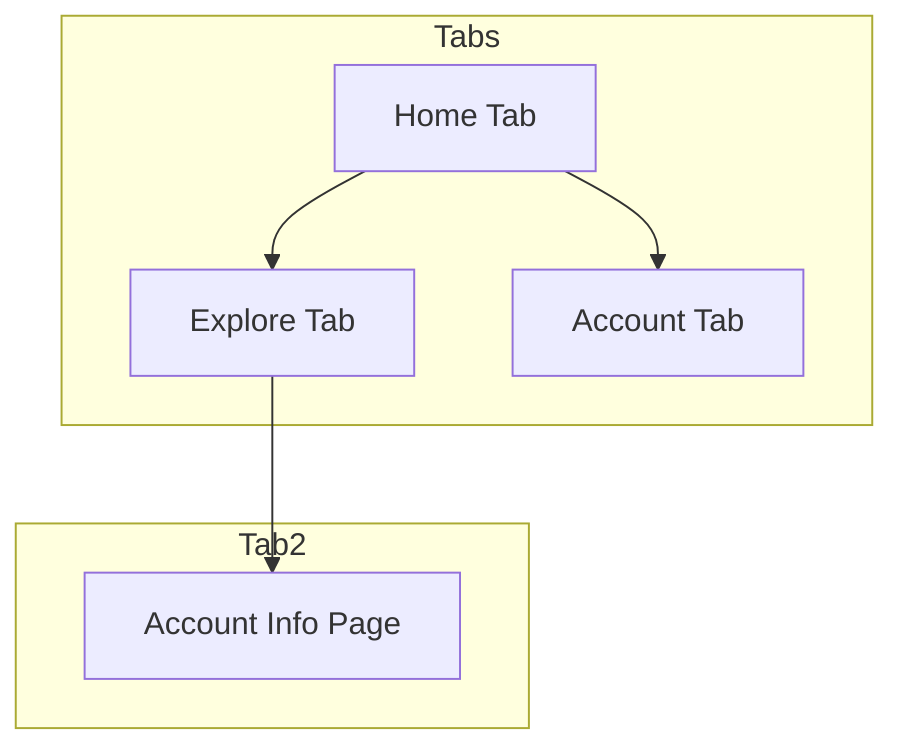

# Wallpaper App

A React Native mobile application for exploring and managing wallpapers.

## Navigation Structure



## Features

- Home Tab: Main landing page
- Explore Tab: Discover new wallpapers
- Account Tab: User profile and settings
- Account Info: Detailed user information

## Tech Stack

- React Native
- Expo Router
- React Native Safe Area Context
- FontAwesome Icons

## Getting Started

### Prerequisites

- Node.js
- npm or yarn
- Expo CLI
- Git

### Installation

1. Clone the repository:
```bash
git clone https://github.com/Sahil-7689/Wallpaper.git
cd Wallpaper
```

2. Install dependencies:
```bash
npm install
# or
yarn install
```

3. Start the development server:
```bash
npm start
# or
yarn start
```

## Project Structure

```
my-app/
├── app/
│   ├── tabs/
│   │   ├── index.tsx
│   │   ├── explore.tsx
│   │   └── account.tsx
│   ├── tab2/
│   │   ├── _layout.tsx
│   │   └── accountinfo.tsx
│   └── _layout.tsx
├── assets/
└── package.json
```

## Contributing

1. Fork the repository
2. Create your feature branch (`git checkout -b feature/AmazingFeature`)
3. Commit your changes (`git commit -m 'Add some AmazingFeature'`)
4. Push to the branch (`git push origin feature/AmazingFeature`)
5. Open a Pull Request


## Contact

Sahil - [@Sahil-7689](https://github.com/Sahil-7689)

Project Link: [https://github.com/Sahil-7689/Wallpaper.git](https://github.com/Sahil-7689/Wallpaper.git)
